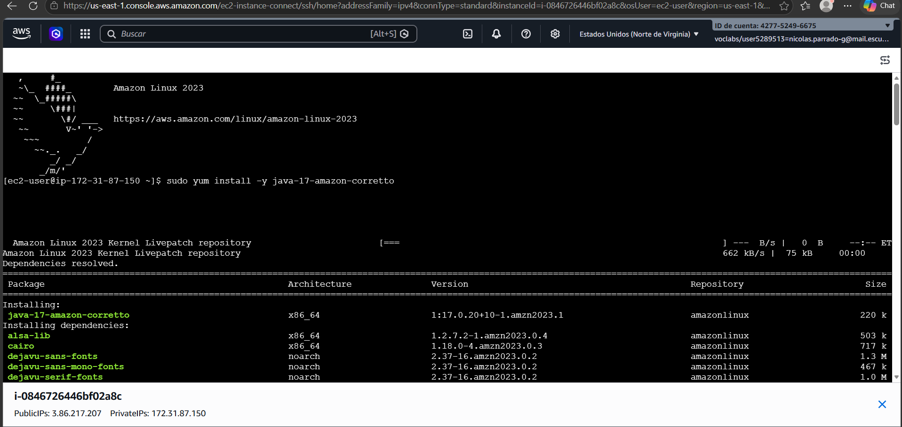
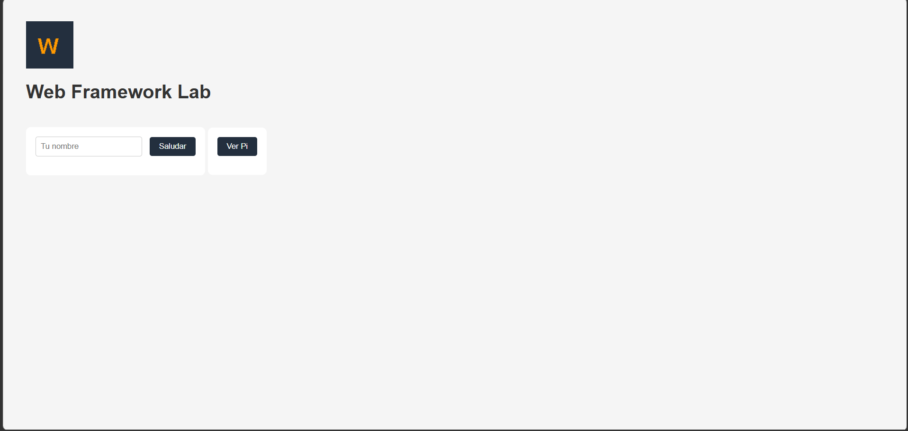
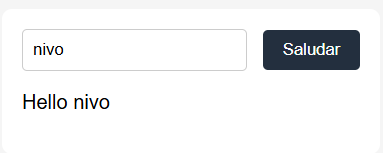
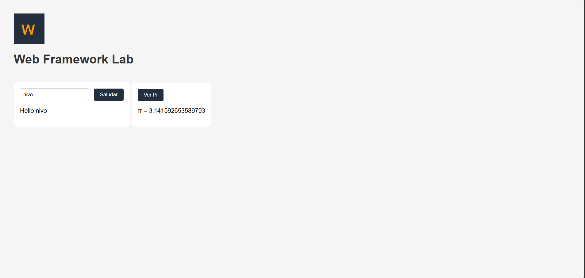

# Web Framework Lab

Un servidor HTTP hecho desde cero en Java puro — sin Spring, sin librerías externas, solo sockets y lambdas. La idea es mostrar cómo separar bien las responsabilidades para que agregar una ruta nueva no implique tocar el servidor.

---

## ¿Qué hace esto?

- Sirve archivos estáticos (HTML, CSS, JS, imágenes)
- Registra rutas GET mediante lambdas
- Lee parámetros de query string
- Lee configuración desde variables de entorno
- Se puede apagar limpiamente con `/shutdown` (solo en desarrollo)
- Corre igual en local y en la nube

---

## Arquitectura — la metáfora del edificio de oficinas

Imagina que el servidor es un edificio de oficinas:

| Edificio | Framework |
|---|---|
| Entrada y recepcionista | `HttpServer` — recibe cada conexión y parsea la petición HTTP |
| Directorio en el lobby | `Router` — mira el path y decide a qué oficina mandar al visitante |
| Oficinas individuales | Lambdas registradas con `get()` — cada una hace su trabajo específico |
| Archivo de documentos | `StaticFileService` — entrega HTML, CSS, JS e imágenes cuando no hay oficina para esa ruta |
| Manual de configuración del edificio | Variables de entorno — puerto, ambiente, prefijo de saludo |
| Procedimiento de cierre | `/shutdown` — termina de atender al visitante actual y luego cierra todo |

### Flujo de una petición

```
Request entrante
      ↓
HttpServer — parsea método, path y query string
      ↓
Router — ¿hay una lambda registrada para este path?
      ↓ sí                    ↓ no
Ejecuta lambda         StaticFileService — ¿existe el archivo?
      ↓                       ↓ sí           ↓ no
Responde con           Sirve el archivo    404 Not Found
el resultado
```

### Componentes principales

- **HttpServer** — acepta conexiones, parsea HTTP, despacha y responde. No sabe nada de rutas ni archivos.
- **WebFramework** — la API pública: `get()`, `staticfiles()`, `start()`, `stop()`. Es lo único que toca el desarrollador de la app.
- **Router** — un `HashMap<String, Route>` que mapea paths a lambdas.
- **StaticFileService** — lee recursos del classpath y detecta el MIME type.
- **Request / Response** — abstracciones simples sobre los datos HTTP.
- **Application** — registra las rutas y arranca el servidor.

---

## Cómo correrlo en local

**Requisitos:** Java 17+, Maven 3.8+

```bash
# Clonar
git clone https://github.com/tu-usuario/tu-repo.git
cd tu-repo

# Compilar y empaquetar
mvn package

# Correr
java -jar target/webframework-lab.jar
```

El servidor queda en `http://localhost:8080`.

Con variables de entorno personalizadas:

```bash
set PORT=9090
set GREETING_PREFIX=Hola
set APP_ENV=development
java -jar target/webframework-lab.jar
```

---

## Variables de entorno

| Variable | Propósito | Default local |
|---|---|---|
| `PORT` | Puerto donde escucha el servidor | `8080` |
| `GREETING_PREFIX` | Prefijo del saludo en `/hello` | `Hello` |
| `APP_ENV` | Ambiente de ejecución (`development` / `production`) | `development` |

> En producción se configura `APP_ENV=production`, lo que desactiva la ruta `/shutdown`.

---

## Endpoints disponibles

| Request | Resultado |
|---|---|
| `GET /hello?name=Pedro` | `Hello Pedro` (o el prefijo configurado) |
| `GET /pi` | `3.141592653589793` |
| `GET /index.html` | Página HTML principal |
| `GET /styles.css` | Hoja de estilos |
| `GET /app.js` | JavaScript del cliente |
| `GET /images/logo.png` | Imagen PNG |
| `GET /shutdown` | Apaga el servidor (solo en development) |
| `GET /cualquier-otra-cosa` | `404 Not Found` |

---

## Despliegue en AWS

### Con Docker (recomendado)

```bash
# Build de la imagen
docker build -t webframework-lab .

# Correr localmente con Docker
docker run -p 8080:8080 -e APP_ENV=production -e GREETING_PREFIX=Hello webframework-lab
```

### En AWS EC2

```bash
# En la instancia EC2 (Amazon Linux 2023)
sudo yum install -y java-17-amazon-corretto
# Subir el JAR y correr:
export PORT=8080
export APP_ENV=production
export GREETING_PREFIX=Hello
java -jar webframework-lab.jar
```

### En AWS App Runner / ECS

1. Subir la imagen a ECR:
```bash
aws ecr create-repository --repository-name webframework-lab
docker tag webframework-lab:latest <account>.dkr.ecr.<region>.amazonaws.com/webframework-lab
docker push <account>.dkr.ecr.<region>.amazonaws.com/webframework-lab
```
2. Crear el servicio en App Runner apuntando al repositorio ECR.
3. Configurar las variables de entorno en la consola de App Runner:
   - `APP_ENV=production`
   - `GREETING_PREFIX=Hello`
   - `PORT=8080`

**URL pública:** `https://<tu-url>.awsapprunner.com`

---

## Evidencia del despliegue

### Página principal


### Recurso estático — imagen
> `GET https://<tu-url>/images/logo.png`


### Endpoint `/hello`
> `GET https://<tu-url>/hello?name=Pedro` → `Hello Pedro`


### Endpoint `/pi`
> `GET https://<tu-url>/pi` → `3.141592653589793`



### `/shutdown` en local (development)
```
GET http://localhost:8080/shutdown
→ Server will stop after this response.
```

### `/shutdown` en producción
```
GET https://<tu-url>/shutdown
→ 404 Not Found
```

---

## Por qué esta arquitectura es mantenible

El punto clave es que las partes que cambian están separadas de las que no cambian.

- **Separación de responsabilidades** — el servidor HTTP no sabe nada de rutas; las rutas no saben nada de sockets.
- **Bajo acoplamiento** — agregar un endpoint nuevo es una línea en `Application.java`, sin tocar `HttpServer`.
- **Configuración externalizada** — el mismo JAR corre en local y en producción, solo cambian las variables de entorno.
- **Extensibilidad** — nuevos servicios se registran como funciones, no como modificaciones al núcleo.

---

## Tests realizados

| Caso | Resultado esperado | ✓ |
|---|---|---|
| `GET /hello?name=Pedro` | `Hello Pedro` | ✓ |
| `GET /hello` (sin parámetro) | `Hello world` | ✓ |
| `GET /pi` | `3.141592653589793` | ✓ |
| `GET /index.html` | HTML de la página | ✓ |
| `GET /images/logo.png` | Imagen PNG | ✓ |
| `GET /ruta-inexistente` | `404 Not Found` | ✓ |
| `GET /shutdown` (development) | Servidor se detiene | ✓ |
| `GET /shutdown` (production) | `404 Not Found` | ✓ |
